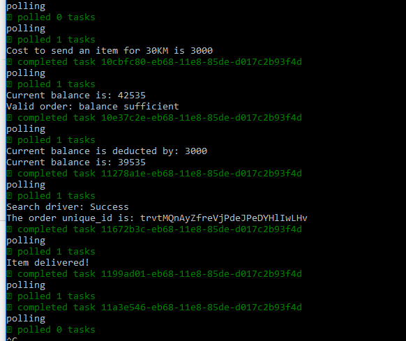
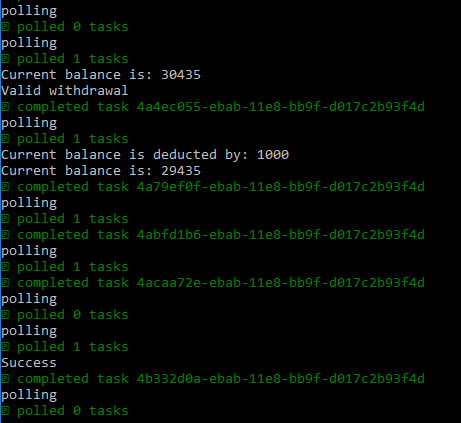

# Tugas Besar PPLBS

Tugas besar Pembangunan Perangkat Lunak Berorientasi Service  

## How to test each task service
1. Run
```
pip install -r requirement.txt
```
2. Run
```
python app.py
```
3. Run
```
python test_task_service.py
```

## How to run BPM

### Prerequisites
1. Camunda Modeler  
2. Camunda BPM
3. NodeJS >= v8.9.4 

### Running Workers
1. Go to task-service-worker directory  
2. Run  
```
npm init task-service-worker -y
```
3. Run   
```
npm install -s camunda-external-task-client-js
npm install soap
```
4. Run   
```
node ./task-service-worker.js
```

### Running task services
1. Run on root directory
```
python app.py
```
2. Run Camunda BPM

### Running Order BPM
1. Open 'order.bpmn' on Camunda Modeler and deploy as 'Order Service' with tenant id 1.
2. Open Postman, send POST request to 
```
http://localhost:8080/engine-rest/process-definition/key/Process_1/tenant-id/1/start
```
with json body  
```
{
    "variables": {
        "secret_key":{
            "value":"vIywNgjTJTNwIHZCXyHTZgfBepWwCx",
            "type":"string"
        },
        "from_lat": {
            "value":7.5,
            "type":"double"
        },
        "from_lng": {
            "value":101.2,
            "type":"double"
        },
        "destination": {
            "value":"-6.0000,128.0000",
            "type":"string"
        },
        "weight": {
            "value":3.2,
            "type":"double"
        },
        "receiver_name": {
            "value":"PPLBS",
            "type":"string"
        },
        "additional_detail": {
            "value":"demo tugas besar",
            "type":"string"
        }
    }
}
```

3. For the intermediate catch even: open Postman, send POST request to
```
http://localhost:8080/engine-rest/message
```
with json body
```
{
    "messageName" : "wait_user_rate",
    "tenantId" : "1",
    "processVariables" : {
        "rate" : {"value" : 4, "type": "long"}
    }
}
```

#### Order Success Screenshot


### Running Withdrawal BPM
1. Open 'withdrawal.bpmn' on Camunda Modeler and deploy as 'Withdrawal Service' with tenant id 2.
2. Open Postman, send POST request to 
```
http://localhost:8080/engine-rest/process-definition/key/Process_1/tenant-id/2/start
```
with json body  
```
{
    "variables": {
        "secret_key":{
            "value":"vIywNgjTJTNwIHZCXyHTZgfBepWwCx",
            "type":"string"
        },
        "amount": {
            "value":1000,
            "type":"long"
        }
    }
}
```

3. For the intermediate catch even: open Postman, send POST request to
```
http://localhost:8080/engine-rest/message
```
with json body
```
{
    "messageName" : "receive_confirmation",
    "tenantId" : "2",
    "processVariables" : {
        "success" : {"value" : true, "type": "boolean"}
    }
}
```

#### Withdrawal Success Screenshot


## Other

### Creating User
Send POST request to http://127.0.0.1:9999/auth with json body as:
```
{
    "email":"customer1@informatika.org",
    "password":"customer1"
}
```

### Deposit Balance
Send POST request to http://127.0.0.1:9999/balance/deposit with 
json body as:
```
{
    "amount":50000
}
```

### Withdraw Balance
Send POST request to http://127.0.0.1:9999/balance/withdraw with 
json body as:
```
{
    "amount":50000
}
```